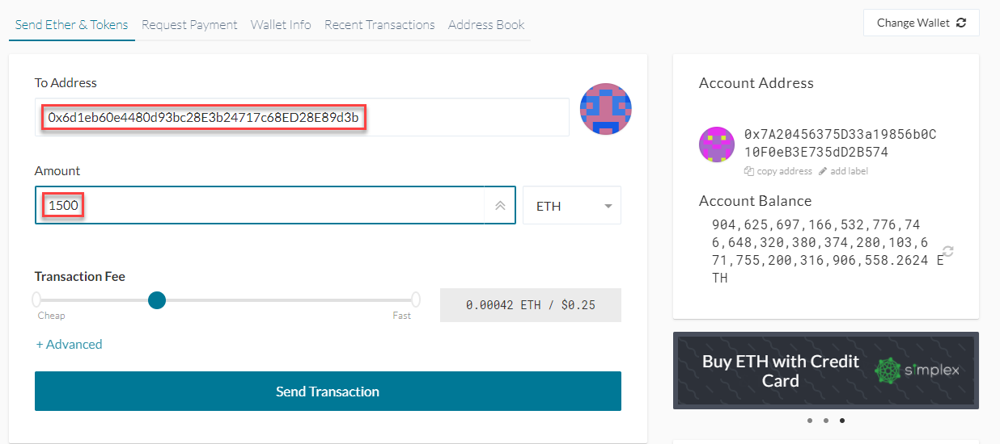

# Proof of Authority Development Chain: Zombie Bank | ZBank: New World Credit Insured

# Background

ZBank is interested in exploring blockchain technology for them and their customers to create a better transaction experience 
in their new apocolyptic world.

ZBank is a small, innovative bank that has utilized what was left of technology to ensure the world is financially back on it's feet again.
We are interested in creating and utilizing blockchain technology, that survived after the Flip, to create a more honest, quick transaction for new and emerging trade routes.

You have decided on setting up a testnet because:

There is no real money involved, which will give your team of developers the freedom to experiment.

Testnets allows for offline development.

In order to set up a testnet, you will need to use the following skills/tools.

* Puppeth, to generate your genesis block.

* Geth, a command-line tool, to create keys, initialize nodes, and connect the nodes together.

* The Clique Proof of Authority algorithm.

Tokens inherently have no value here, so we will provide pre-configured accounts and nodes for easy setup.

# Before you begin
#### Follow these instructions to ensure all dependenceis are met before you begin -- [Blockchain-install](blockchain-install-guide.md)

# Instructions

## These steps only require an initial setup and do not need to be duplicated.

* Create a new project directory called ZBANK-BLOCKCHAIN

* Create accounts for two (or more) nodes for the network with a separate `datadir` for each using `geth`.

* Because the accounts must be approved, we generated two new nodes with new account addresses that will serve as our pre-approved sealer addresses.
  * Navigate to your command terminal.  **NOTE:** Windows users use `git-bash`
  * Activate your ethereum environment `conda activate ethereum`
  * Run the following commands in your terminal.  Be sure the save the Public Address once it's been created. 
      * ./geth --datadir node1 account new
      * ./geth --datadir node2 account new

* Using your command terminal run `./puppeth` and follow the instructions below.
  * Name your network, and select the option to configure a new genesis block.
  * Choose the `Clique (Proof of Authority)` consensus algorithm.
	* Paste both account addresses from the first step one at a time into the list of accounts to seal. **Note:** `./puppeth` will show **0x** do not add this again.
  * Paste them again in the list of accounts to pre-fund. There are no block rewards in PoA, so you'll need to pre-fund.
  * Choose `yes` for pre-funding the pre-compiled accounts (0x1 .. 0xff) with wei. 
  * specify your chain/network ID if you want an explicit one: ZBank uses 999
  * Complete the rest of the prompts, and when you are back at the main menu, choose the "Manage existing genesis" option.
  * Export genesis configurations. This will fail to create two of the files, but you only need `zbankblockchain.json`.
  * You can delete the `zbankblockchain-harmony.json` file.

## Puppeth Configuration

  
  * Initialize each node with the new `zbankblockchain.json` with `geth`.
  * Using `geth`, initialize each node with the new `zbankblockchain.json`.
    * ./geth --datadir node1 init zbankblockchain.json
    * ./geth --datadir node2 init zbankblockchain.json

* Run the nodes in separate terminal windows with the commands:
  *  ./geth --datadir node1 --unlock "NODE 1 PUBLIC ADDRESS" --mine --rpc --allow-insecure-unlock
  *  ./geth --datadir node2 --unlock "NODE 2 PUBLIC ADDRESS" --mine --port 30304 --bootnodes "enode://NODE 1 ENODE ADDRESS (SEE SCREENSHOT FOR LOCATION)@127.0.0.1:30303" --ipcdisable --allow-insecure-unlock

    * **NOTE:** Type your password and hit enter - even if you can't see it visually!
Now you will launch the second node and configure it to let us talk to the chain via RPC.

* You should now see both nodes producing new blocks, congratulations!

### Send a test transaction

* Use the MyCrypto GUI wallet to connect to the node with the exposed RPC port.
* You will need to use a custom network, and include the chain ID, and use ETH as the currency.
* 

* Select your custom network
* 

* Import the keystore file from the `node1/keystore` directory into MyCrypto. This will import the private key.
* 

* Note you have a high Account Balance
* 

* Send a transaction from the `node1` account to the `node2` account.
* 

* Copy the transaction hash and paste it into the "TX Status" section of the app, or click "TX Status" in the popup.
* 

* Celebrate, you just created a blockchain and sent a transaction!

